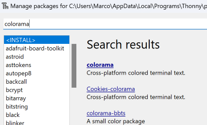
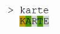
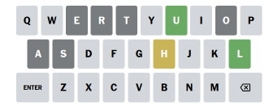
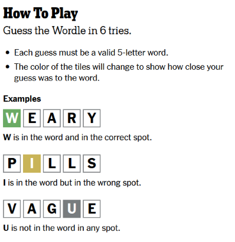

# Auftrag Wordle


Wir programmieren das Wordle-Ratespiel neu. Das original Spiel findet man bei der [New York Times](https://www.nytimes.com/games/wordle/index.html). Es gibt auch eine [deutsche Version mit Umlauten](https://wordle.ruinelli.ch/).

## Nötige Schritte für die Basisversion

### 1. Datei mit den Wörtern einlesen

Die Datei `wordlist.txt` enthält alle deutschen Wörter mit 5 Buchstaben. Mit dem Befehl `open` kann man eine Datei öffnen. Dabei muss man (auf Windows) noch die Textkodierung angeben:
```py
f = open("wordlist.txt", encoding="utf-8")
contents = f.read()
f.close()
```

### 2. Mit `random` Ein zufälliges Wort auswählen:

```py
import random

glace = ["Erdbeere", "Schokolade", "Vanille"]
my_choice = random.choice(glace)
print(my_choice)
```


### 3. Farbigen Text ausgeben:

Zuerst müssen wir die Bibliothek `colorama` installieren. Wähle dazu in Thonny im Menu `Werkzeuge` den Eintrag `Verwalte Pakete ...`. Suche dort im Suchfeld nach `colorama` suchen, auswählen und installieren:




Nun kann man farbigen Text ausgeben:
```py
from colorama import Fore, Back, Style

print(f"{Fore.BLUE}{Back.YELLOW}Hello!{Style.RESET_ALL}")
```

### 4. Grosser Game-Loop

In einem grossen `while`-Loop, kann der:ie User:in nach ihrem Wortvorschlag gefragt werden. Der Vorschlag muss überprüft werden: Ist es ein gültiges deutsches Wort mit fünf Buchstaben?

In einem zweiten Schritt kann dann überprüft werden, ob die Lösung schon gefunden wurde. Falls nicht, kann man zuerst nach den korrekt platzierten Buchstaben suchen, und in einem zweiten Schritt nach den Buchstaben, welche im Lösungswort vorkommen, aber nicht korrekt platziert sind.

_Tipp:_ Die farbigen Kästchen vordefinieren und die Ausgabe (Kästchen) per default auf weiss setzen:
```py
WHITE = f"{Back.WHITE} {Style.RESET_ALL}"
YELLOW = f"{Back.YELLOW} {Style.RESET_ALL}"
GREEN = f"{Back.GREEN} {Style.RESET_ALL}"

results = [WHITE, WHITE, WHITE, WHITE, WHITE]
...
```


## Erweiterungen

### Limitierung der Anzahl Rateversuche

Limitiere die Rateversuche auf sechs. So wie im Original-Wordle-Spiel.

### Lösungshinweise mit Buchstaben

Anstatt nur farbigen Kästchen, kann man die Buchstaben des Lösungsvorschlag mit der entsprechenden Farbe einfärben und ausgeben:




### Zusammenfassung am Schluss

Im original Spiel wird am Schluss eine Zusammenfassung angezeigt, wo neben der Anzahl nötiger Versuche auch der Verlauf des Spiels mit Emojis dargestellt wird:

    Wordle 213 4/6

    ⬜⬜⬜⬜⬜
    ⬜🟨⬜⬜⬜
    ⬜🟩🟩⬜🟨
    🟩🟩🟩🟩🟩

[J. Smith-Cameron auf Twitter](https://twitter.com/j_smithcameron/status/1483460318269431814)

Dadurch, dass viele Leute angefangen haben diese Zusammenfassung ihres täglichen Wordle-Rätsels auf den sozialen Medien zu teilen, wurde das Spiel erst so richtig populär.

Gebe am Schluss noch einmal eine Zusammenfassung des Spiels aus, bei welcher jedoch das Lösungswort nicht ersichtlich ist.


### Separate Liste mit Lösungswörter (optional)

Nicht alle Wörter in der Wörterliste lassen sich gut erraten. Darunter gehören insbesondere grammatikalische Beugungen im Genitiv wie zum Beispiel (des) _Buchs_,  (des) _Bachs_, und so weiter.

Erstelle und verwende zwei Wörterlisten für das Programm. Eine Liste enthält alle korrekten deutschen Wörter mit fünf Buchstaben, die zweite, kürzere Liste nur geeignete Lösungswörter.


### Die verwendeten Buchstaben anzeigen (optional)

Für Spieler:innen ist es hilfreich zu sehen, welche Buchstaben sie bereits verwendet haben.

Im original Wordle wird eine Tastatur mit farbig markierten Buchstaben angezeigt:



Stelle die bereits verwendeten Buchstaben in einer geeigneten Form dar.


### Spielanleitung am Anfang anzeigen (optional)

Kommt man zum ersten Mal auf die Wordle-Webseite, wird eine Spielanleitung angezeigt:



Zeige zum Start des Spiels eine ähnliche Anleitung dar.


### Pro Tag ein Wort (optional)

Im original Wordle gibt es pro Tag ein Lösungswort. Modifiziere dein Programm so, dass das Lösungswort jeden Tag ändert, aber während eines ganzen Tages gleich bleibt.
